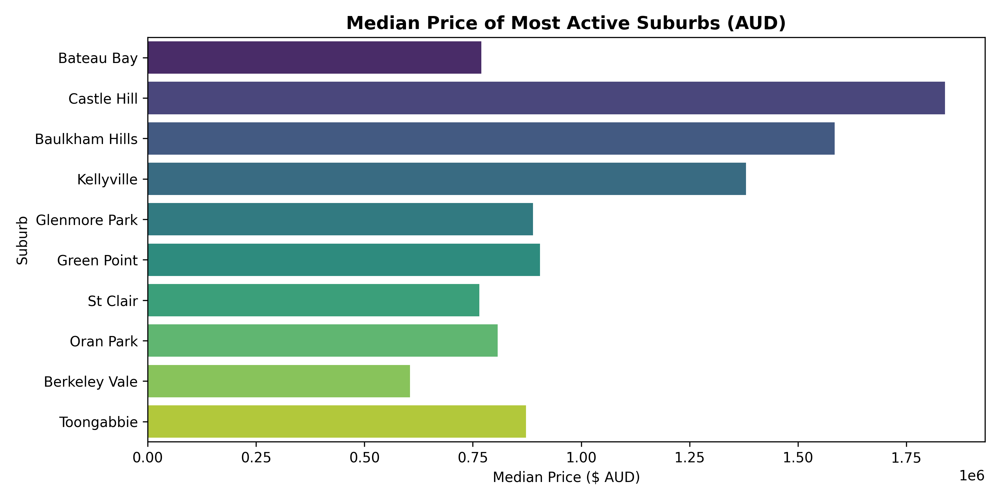

# Sydney Housing Market Analysis

## Project Overview
This project provides a data-driven analysis of property transaction trends across Sydney suburbs. Using Python for data auditing, cleaning, and aggregation, the analysis focuses on key economic indicators; specifically comparing median versus mean prices to evaluate market distribution and identifying top suburbs by transaction volume.

## Key Findings & Data Audit
* **Data Integrity:** Conducted a missing value audit (`df.isnull().sum()`) across the dataset to ensure zero null records in key pricing variables.
* **Price Distribution:** Calculated both median and mean price metrics to account for high-end outlier properties skewing average valuations.
* **Volume Activity:** Identified top 10 suburbs by sales volume to highlight sub-markets with the highest liquidity and buyer activity.

## Visualisation

## Tools & Technologies Used
* **Environment:** Google Colab
* **Language:** Python 3
* **Libraries:** `pandas` (Data Aggregation), `matplotlib` & `seaborn` (Data Visualisation)
* **Version Control:** GitHub
